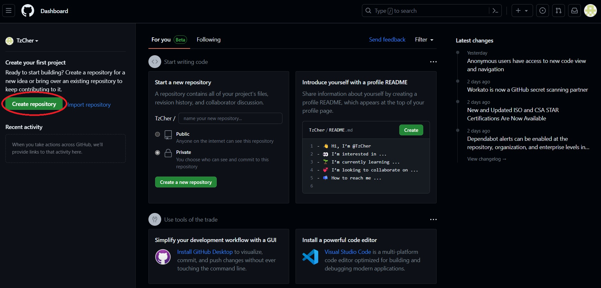
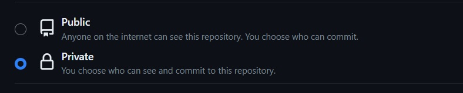
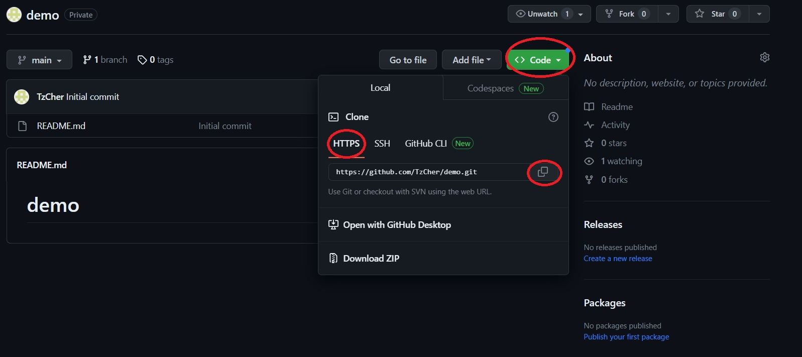
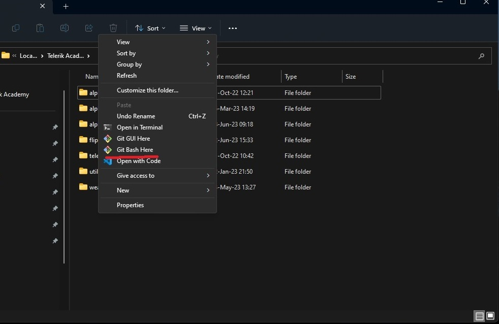
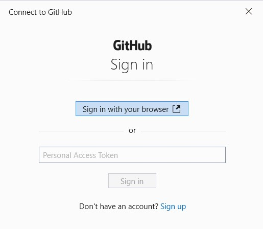

# Git - Tasks

### 1. First you should make an account in [https://github.com](https://github.com)

   - Create an account and share it with the trainers in the forum

### 2. Practice

1. Create a new repository

    

    - Name it {Your-Name}, for example Trendafil-Stamatov
    - It is **mandatory** to be private
    - You are **not allowed** to commit any of the exam tasks there


    

2. Clone the your repository

   - Open your repository

     

   - Copy the **HTTPS url**
   - Open the folder on your computer, where you will store your repositories
   - Right click and select **Git Bash Here** option
   
   


   - Execute the following command (it will clone the repository to your computer)
   - If you've copied the git repo link from github, you can simply type "git clone", write click and paste the copied link, then press "Enter"

     ```bash
     git clone https://github.com/**AddYourNameHere**.git
     ```

   

   - If using Windows: It will prompt you for credentials from github.com (it is a one time only)

     

   - If you misspell your credentials you need to go to *Control Panel -> User Accounts -> Credential Manager.* Click on **Windows Credentials**. Down in the **Generic Credentials** window click on *git -> edit* - now enter the correct credentials.


3. Make local changes
   
     - Clone your newly created repository like the one which we showed earlier
     - Make a change to the README.md file
     - Open the folder and right click and use **Git Bash Here** option again
     - Type **git status** - this will show you all the files that have been changed/modified/deleted
     - Or use any GUI (Graphical User Interface) such as VSCode
     - Now you have to sync your local changes with github.com. How can you do that?
     
3. Make changes in github (it simulates someone pushing new changes there)
   - Open [https://github.com](https://github.com)
   
   - Navigate to your repository
   
   - Open the README.md file
   
   - Now with the **Edit this file** (icon with the pencil) button you can make changes
   
   - Commit the changes
   
   - Now you have to sync the changes to your local repository. How you can do that?
   
4. Add your work so far

   - Go to your projects
   - Copy them in cloned repo. Use some nice organization, for example JS Core / Functions / Tasks
   - Commit newly added files
   - Update the remote

**HINTS**

Use any GUI by your choice - **preferably VSCode** or you could use the commands below and figure out how to use them

```bash
git pull
git add .
git push
git commit -m "Some message"
```
